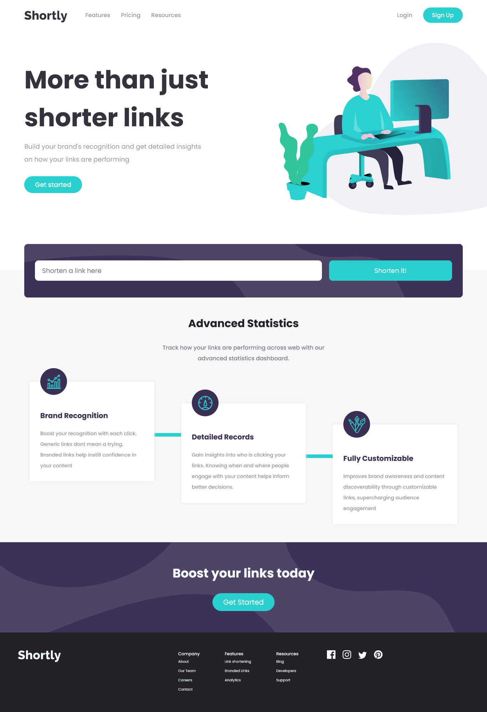

# Frontend Mentor - Shortly URL shortening API Challenge solution

This is a solution to the [Shortly URL shortening API Challenge challenge on Frontend Mentor](https://www.frontendmentor.io/challenges/url-shortening-api-landing-page-2ce3ob-G). Frontend Mentor challenges help you improve your coding skills by building realistic projects. 

## Table of contents

- [Frontend Mentor - Shortly URL shortening API Challenge solution](#frontend-mentor---shortly-url-shortening-api-challenge-solution)
  - [Table of contents](#table-of-contents)
  - [Overview](#overview)
    - [The challenge](#the-challenge)
    - [Screenshot](#screenshot)
      - [Desktop Screenshot](#desktop-screenshot)
    - [Links](#links)
  - [My process](#my-process)
    - [Built with](#built-with)
    - [Useful resources](#useful-resources)
  - [Author](#author)

## Overview

### The challenge

Users should be able to:

- View the optimal layout for the site depending on their device's screen size
- Shorten any valid URL
- See a list of their shortened links, even after refreshing the browser
- Copy the shortened link to their clipboard in a single click
- Receive an error message when the `form` is submitted if:
  - The `input` field is empty

### Screenshot

#### Desktop Screenshot

### Links

- Solution URL: [https://github.com/chiefcipher/url-shortener](https://github.com/chiefcipher/url-shortener)
- Live Site URL: [https://chiefcipher.github.io/url-shortener/](https://chiefcipher.github.io/url-shortener/)

## My process

### Built with

- Semantic HTML5 markup
- SCSS 
- Flexbox
- Grid
- [React](https://reactjs.org/) - JS library

### Useful resources

- [https://shrtco.de/](https://shrtco.de/) - This is the public api that helped me shorten the URLS.

## Author

- Website - [Samuel Yakubu](http://chiefcipher.netlify.app/)
- Frontend Mentor - [@chiefcipher](https://www.frontendmentor.io/profile/chiefcipher)
- Twitter - [@chief_cipher](https://twitter.com/chief_cipher)
